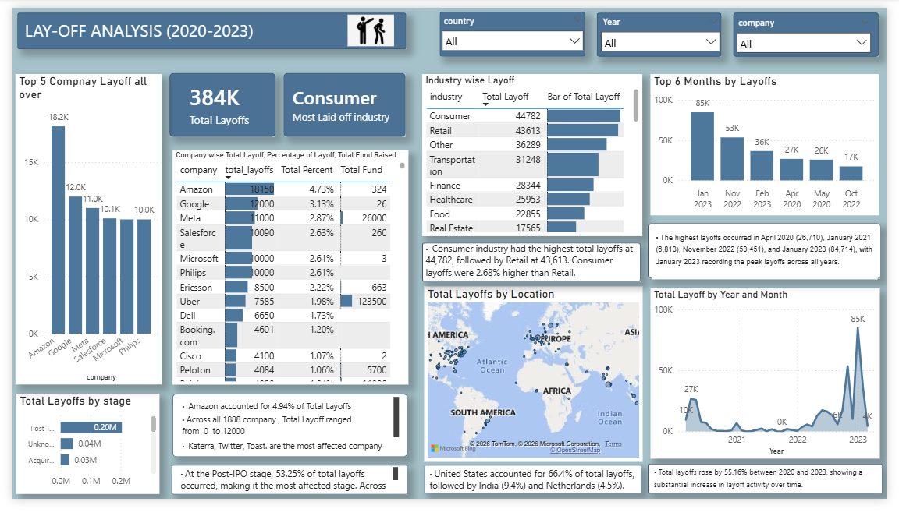

# Global Layoffs Analysis Dashboard (2020–2023)

## Project Overview

This project analyzes global layoffs data from 2020 to 2023 using SQL for data cleaning and business analysis, and Power BI for interactive dashboard visualization. The goal was to transform raw layoffs data into meaningful business insights to understand trends, affected industries, companies, geographic distribution, and layoff patterns over time.

This project demonstrates end-to-end data analytics workflow including:

- Data cleaning using SQL
- Exploratory data analysis using SQL business queries
- Data modeling and visualization using Power BI
- Dashboard design and insight generation

---

## Dashboard Preview




---

## Dataset Information

The dataset contains global layoffs information including:

- Company name
- Location
- Country
- Industry
- Total employees laid off
- Percentage laid off
- Date of layoff
- Company stage (Post-IPO, Series A, etc.)
- Funds raised

Dataset size:

- 384,000+ layoffs
- 1,888 companies
- 60 countries
- 34 industries
- Time period: 2020–2023

---

## Step 1: Data Cleaning using SQL

Data cleaning was performed in MySQL to ensure accurate and reliable analysis.

A copy of the original table was created to preserve raw data integrity:

```sql
CREATE TABLE layoffs_copy2 LIKE layoffs;
INSERT INTO layoffs_copy2 SELECT * FROM layoffs;


1. Removing duplicate records

Duplicates were identified using ROW_NUMBER():

WITH duplicate_cte AS (
SELECT *,
ROW_NUMBER() OVER(
PARTITION BY company, location, industry, total_laid_off,
percentage_laid_off, date, stage, country, funds_raised_millions
) AS row_num
FROM layoffs_copy2
)
DELETE FROM duplicate_cte WHERE row_num > 1;


2. Standardizing text values

Ensured consistent formatting of company, industry, and country names:

UPDATE layoffs_copy2
SET company = TRIM(company);

Standardized industry names:

UPDATE layoffs_copy2
SET industry = 'Crypto'
WHERE industry LIKE 'Crypto%';


3. Handling NULL and blank values

Converted blank values to NULL:

UPDATE layoffs_copy2
SET industry = NULL
WHERE industry = '';

Filled missing values using logical inference from existing company records.


4. Converting date format

Ensured proper date format for time analysis:

UPDATE layoffs_copy2
SET date = STR_TO_DATE(date, '%m/%d/%Y');

Changed column type:

ALTER TABLE layoffs_copy2
MODIFY COLUMN date DATE;
Step 2: Exploratory Data Analysis using SQL

Business questions were answered using SQL queries.

1.Total layoffs globally

SELECT SUM(total_laid_off)
FROM layoffs_copy2;

Result: 384,000+ layoffs

2.Total companies affected

SELECT COUNT(DISTINCT company)
FROM layoffs_copy2;

Result: 1,888 companies

3.Industry with highest layoffs

SELECT industry, SUM(total_laid_off)
FROM layoffs_copy2
GROUP BY industry
ORDER BY 2 DESC;

Result: Consumer industry most affected

4.Companies with highest layoffs

SELECT company, SUM(total_laid_off)
FROM layoffs_copy2
GROUP BY company
ORDER BY 2 DESC;

Result: Amazon, Google, Meta among highest

5.Layoffs trend over time

SELECT YEAR(date), SUM(total_laid_off)
FROM layoffs_copy2
GROUP BY YEAR(date)
ORDER BY YEAR(date);

Result: Peak layoffs in 2022 and 2023

6.Monthly trend and cumulative layoffs

WITH monthly AS (
SELECT DATE_FORMAT(date,'%Y-%m') AS month,
SUM(total_laid_off) AS layoffs
FROM layoffs_copy2
GROUP BY month
)
SELECT *,
SUM(layoffs) OVER(ORDER BY month)
FROM monthly;
Step 3: Power BI Dashboard Development

Cleaned dataset was imported into Power BI for visualization.

Data modeling included:

Creating calculated columns for Year, Month, and Day

Creating DAX measures:

Example:

Total Layoffs:

Total Layoffs = SUM(layoffs_copy2[total_laid_off])

Total Companies:

Total Companies = DISTINCTCOUNT(layoffs_copy2[company])

Latest Year Layoffs:

Latest Year Layoffs =
CALCULATE(
SUM(layoffs_copy2[total_laid_off]),
YEAR(layoffs_copy2[date]) =
MAXX(ALL(layoffs_copy2), YEAR(layoffs_copy2[date]))
)


Step 4: Dashboard Visualizations

The dashboard includes:

1. KPI Cards

2. Total Layoffs

3. Total Companies

4. Total Countries

5. Latest Year Layoffs

6. Trend Analysis

7. Layoffs by Year and Month

8. Company Analysis

9. Top companies by layoffs

10. Industry Analysis

11. Layoffs by industry

12. Geographic Analysis

13. Layoffs by country

14. Layoffs by location (map)

15. Company Stage Analysis

16. Layoffs by funding stage

Step 5: Business Insights Generated

• Key insights derived from dashboard:

• Total 384K employees laid off globally

• Consumer industry had highest layoffs

• United States accounted for majority of layoffs

• Layoffs peaked in 2022 and early 2023

• Amazon had highest layoffs among companies

• Post-IPO companies had highest layoffs

• Significant increase in layoffs after COVID-19 period


• Dashboard Preview

Tools Used

SQL (MySQL)

Power BI

Excel

• Skills Demonstrated

Data Cleaning

SQL Window Functions

Data Analysis

Data Visualization

Dashboard Development

DAX Measures

Business Insight Generation


• Files Included

Layoffs_Dashboard.pbix

Layoffs_Dashboard.pdf

Layoffs_Dashboard.png

layoffs_cleaning.sql


Author

Rohit Roy

Aspiring Data Analyst
